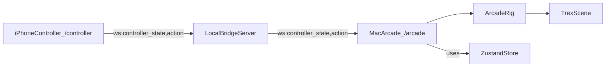

## PRD: iPhone Controller (Local Wi‑Fi) — Arcade Mode

### Metadata
- **Product**: Dino Demo (Next.js + R3F exhibit)
- **Feature**: iPhone-as-controller “Arcade Mode”
- **Audience**: Coding agent implementing the feature
- **Status**: Ready for phased implementation
- **Connectivity**: **Local Wi‑Fi only** (Macbook host + iPhone controller on same LAN)
- **Control style**: **Touch-only** (joystick + buttons)

---

## 1) Problem / Opportunity

The current experience is a cinematic, interactive 3D museum exhibit. It’s impressive, but it’s still “viewer-first”.

This feature adds a new, highly demoable mode: the iPhone becomes a **game controller** for the exhibit running on a Macbook, enabling real-time control of the dinosaur (lift up/down, steer/rotate, walk, roar, etc.) over local Wi‑Fi.

---

## 2) Goals / Non‑Goals

### Goals
- **Arcade Mode view on Mac** that feels like a game (focused camera, HUD, controller-ready).
- **Controller view on iPhone**: joystick + buttons with immediate feedback.
- **Low-latency, reliable local networking** using WebSockets.
- **Simple pairing** using a URL and optional QR code.
- **Reuse existing assets and animations** already in the repo.
- **Deliver in phases** with working increments each phase.

### Non‑Goals (initial phases)
- No cloud realtime service (Ably/Pusher/Supabase Realtime/etc.).
- No WebRTC peer-to-peer (signaling/TURN not in scope).
- No native iOS app (controller is a web page in Safari).
- No multiplayer or multi-controller choreography (single iPhone → single Mac session).
- No complex physics/gameplay systems (can be Phase 3+ if desired).

---

## 3) Users & Primary Use Cases

### Users
- **Presenter (You)**: runs exhibit on Mac, uses iPhone to drive a “wow” live demo.
- **Observer**: watches the dinosaur respond (no direct interaction).

### Use cases
- “Scan QR, connect, and lift the dino up/down live.”
- “Tap Walk to start/stop a looping walk; steer with joystick.”
- “Tap Roar to trigger roar animation + audio.”

---

## 4) Current System Context (Existing Capabilities to Reuse)

Already implemented in codebase:
- **Mode switching**: skeleton vs skin (`app/_lib/store.ts`, `app/_components/TrexScene.tsx`)
- **Skin reveal transition** via clipping planes (`app/_lib/three/skinReveal.ts`)
- **Walk animation** (skeleton one-shot) (`app/_components/models/TrexSkeleton.tsx`)
- **Roar animation + audio** (skin) (`app/_components/models/TrexSkin.tsx`, `public/audio/trex-roar.m4a`)
- **Zustand store actions** for mode/walk/roar (`app/_lib/store.ts`)
- **Director/tour system** (should be disabled/ignored in Arcade Mode)

This feature should be additive and must not break the existing `/` exhibit route.

---

## 5) UX Overview

### Mac: Arcade Mode (host)
- Dedicated view (a “tab” implemented as a separate route is acceptable).
- Shows:
  - Connection status (Disconnected / Connecting / Connected)
  - Pairing helper: URL + optional QR code
  - “Enable audio” gate (see audio constraints)
  - Basic HUD: current mode, walk state, last controller input timestamp
- When connected:
  - iPhone joystick + buttons directly drive dinosaur motion/actions.

### iPhone: Controller (client)
- Dedicated mobile-first route.
- Shows:
  - Large joystick area (thumb friendly)
  - Buttons: Walk (toggle), Roar, Mode toggle, Reset
  - Connection status + session id

---

## 6) Functional Requirements

### 6.1 Routing / Entry Points
- **FR-ROUTE-1**: Add a new Mac view for Arcade Mode (recommended: `/arcade`).
- **FR-ROUTE-2**: Add a new iPhone view for controller (recommended: `/controller`).
- **FR-ROUTE-3**: Arcade Mode is discoverable from existing UI (button/link), but must remain optional.

### 6.2 Pairing & Sessions
- **FR-PAIR-1**: Arcade Mode generates a session id (short code) like `AB12` (or longer if desired).
- **FR-PAIR-2**: Controller joins by opening a URL that includes the session, e.g. `/controller?session=AB12`.
- **FR-PAIR-3**: Only a controller in the same session can control the Mac view.
- **FR-PAIR-4**: If multiple controllers connect, the most recently active controller wins (Phase 2 can refine).

### 6.3 Networking (Local Wi‑Fi Only)
- **FR-NET-1**: Implement a **local bridge server** (Node process) running on the Mac.
- **FR-NET-2**: The Mac Arcade page and iPhone Controller page connect via **WebSocket** to the bridge.
- **FR-NET-3**: Bridge supports:
  - joining a session
  - broadcasting controller input to the Mac client in that session
  - heartbeat/ping to detect disconnects

### 6.4 Controller Inputs
- **FR-CTRL-1**: Joystick sends normalized axes \(x,y\) in \([-1,1]\) at ~20–30 Hz.
- **FR-CTRL-2**: Buttons send discrete actions:
  - `walk_toggle`
  - `roar`
  - `mode_toggle` (skeleton/skin)
  - `reset_pose`
- **FR-CTRL-3**: The controller UI must prevent page scrolling while interacting (use `touch-action: none`).
- **FR-CTRL-4**: The controller shows connection state and attempts reconnect (Phase 2).

### 6.5 Mac Game Mappings
Minimum mapping set:
- **FR-MAP-1 (Lift)**: joystick Y maps to vertical offset (translate dinosaur up/down).
- **FR-MAP-2 (Steer)**: joystick X maps to yaw rotation (rotate dinosaur left/right).
- **FR-MAP-3 (Walk)**: walk toggle starts/stops walking behavior (Phase 1 may be one-shot; Phase 2 loops).
- **FR-MAP-4 (Roar)**: triggers roar animation; if sound is unlocked, play audio too.

### 6.6 Audio Autoplay Constraints (Required)
Remote commands are not always considered a “user gesture” by the browser, so audio playback may be blocked unless the Mac page has been user-interacted with.

- **FR-AUDIO-1**: Arcade Mode must include a one-time “Enable audio” button that the presenter clicks on the Mac.
- **FR-AUDIO-2**: If audio is locked, roar still animates and UI indicates “Audio locked”.

### 6.7 Safety / Mode Constraints
- **FR-SAFE-1**: Arcade Mode should not start the director tour or explode choreography.
- **FR-SAFE-2**: If the existing OrbitControls are present, Arcade Mode must avoid fighting them:
  - recommended: disable OrbitControls when controller is active, or separate Arcade Scene from Exhibit Scene.

---

## 7) Non‑Functional Requirements

- **Latency target**: < 100ms joystick-to-motion on local Wi‑Fi.
- **Stability**: avoid jitter with deadzone + smoothing on the Mac side.
- **Rate limiting**: controller should throttle joystick messages to ~20–30 Hz.
- **Performance**: maintain current performance posture (no heavy per-frame allocations).
- **Compatibility**: iPhone Safari latest, Mac Chrome/Safari.

---

## 8) Technical Architecture (Local Wi‑Fi)

### 8.1 High-level Components
- **Next.js app**:
  - Mac: `/arcade`
  - iPhone: `/controller`
- **Local bridge server**:
  - WebSocket server running on Mac (e.g., port `8787`)

### 8.2 Message Protocol (v1)
Define a shared TypeScript contract used by:
- bridge server
- Mac Arcade page
- iPhone Controller page

Recommended types (example):

```ts
export type ClientRole = 'mac' | 'phone';

export type ClientHello = {
  type: 'hello';
  session: string;
  role: ClientRole;
  clientId: string;
};

export type ControllerState = {
  type: 'controller_state';
  session: string;
  t: number;   // ms timestamp
  seq: number; // monotonically increasing
  joy: { x: number; y: number }; // -1..1
};

export type ControllerAction = {
  type: 'action';
  session: string;
  t: number;
  seq: number;
  action: 'walk_toggle' | 'roar' | 'mode_toggle' | 'reset_pose';
};

export type ServerMessage =
  | { type: 'status'; session: string; ok: boolean; message?: string }
  | { type: 'ack'; session: string; seq: number; ok: boolean };

export type WireMessage = ClientHello | ControllerState | ControllerAction | ServerMessage;
```

### 8.3 Data Flow



### 8.4 Local Network / URL Practicalities
If the Mac opens the app at `http://localhost:3000`, a QR that points to `localhost` will not work on iPhone.

Implementation must support a workable pairing URL:
- Recommended: run Next dev server bound to LAN (`0.0.0.0`) and open the Mac page using `http://<mac-lan-ip>:3000/arcade`.
- Arcade Mode should display the computed “controller URL” based on host and session.
- Phase 2 can improve this by having the bridge server expose a small `/info` endpoint returning the detected LAN IP for convenience.

---

## 9) Phased Implementation Plan (Do not skip stages)

### Phase 0 — PRD + Scaffolding (smallest shippable slice)
**Scope**
- Add shared message protocol module.
- Add `/arcade` and `/controller` routes with basic layout + connection status placeholders.
- Add a minimal bridge server that accepts WebSocket connections and routes messages by session.

**Acceptance criteria**
- Mac can open `/arcade`; iPhone can open `/controller?session=XXXX`.
- Both can connect to the bridge and show Connected/Disconnected state.
- No dinosaur control required yet.

**Deliverables**
- PRD (this file)
- Protocol types file (new)
- Bridge server script (new)
- Basic UI scaffolding (new routes)

### Phase 1 — MVP “It Works” Controller (core demo value)
**Scope**
- Implement joystick UI on iPhone and stream `controller_state` at ~20–30 Hz.
- Implement buttons on iPhone: walk toggle, roar, mode toggle, reset.
- On Mac Arcade page:
  - apply joystick Y to dinosaur lift (translate Y)
  - apply joystick X to dinosaur yaw (rotate Y)
  - map button actions to existing store actions:
    - `walk_toggle` → trigger walk behavior (can be one-shot initially)
    - `roar` → trigger roar animation (sound depends on audio gate)
    - `mode_toggle` → toggle skeleton/skin
  - add “Enable audio” button and UI state.
- Add pairing UX:
  - show controller URL
  - optional QR code (nice-to-have in Phase 1; can be deferred to Phase 2)

**Acceptance criteria**
- On local Wi‑Fi: open `/arcade` on Mac and `/controller` on iPhone, join same session, and the dinosaur responds in real time.
- Roar triggers animation reliably; audio plays after clicking Enable audio on Mac.

### Phase 2 — Game Feel + Reliability
**Scope**
- Walk becomes a true toggle/loop (not one-shot), with clean stop behavior.
- Add deadzone and smoothing for joystick inputs on Mac (avoid jitter).
- Reconnect behavior:
  - controller reconnects automatically, resends `hello`, resumes session.
- Improve pairing:
  - QR code generation
  - optional bridge `/info` endpoint to help with LAN IP discovery
- Improve HUD: last input time, active controller id.

**Acceptance criteria**
- Walk toggle feels consistent and stops cleanly.
- Inputs are stable (no micro-jitter when thumb stops).
- Temporary disconnect/reconnect does not require manual refresh in the common case.

### Phase 3 — Creative Expansions (pick 1–2 only; keep bounded)
Possible expansions:
- Simple arena (ground plane, camera follow, bounds).
- Score counter + collectible targets.
- Multiple specimen selection (you already have raptor folders in `public/models/*`).
- Additional animation set (skin walk/run; jump/stomp; turn-in-place).

**Acceptance criteria**
- One clear “mini-game loop” that’s demoable in < 60 seconds.

---

## 10) “Artifacts Needed” Checklist (What the owner should provide)

### Required (for Phase 1)
- **Control mapping decision**:
  - confirm joystick Y = lift up/down (recommended for first demo), joystick X = steer/yaw.
- **Preferred button set**:
  - Walk, Roar, Mode toggle, Reset (default).

### Optional (high-impact for Phase 2/3)
- **Loopable skin walk/run clip** (if you want skin to move while walking).
- Additional SFX or animation clips (jump, stomp, etc.).

### Environment / Setup (local networking)
- Ability to run both:
  - Next dev server accessible on LAN (bind to `0.0.0.0`)
  - bridge server port open to LAN (macOS firewall allowance if prompted)

---

## 11) Risks & Mitigations

- **Audio autoplay restrictions**: mitigate with explicit “Enable audio” on Mac.
- **Local IP/URL confusion**: mitigate by instructing to open Mac using LAN IP; optionally add bridge `/info`.
- **OrbitControls fighting controller**: mitigate by disabling controls when controller active or isolating Arcade scene.
- **Jittery joystick**: mitigate with deadzone + smoothing and message throttling.

---

## 12) Out of Scope (Explicit)
- Remote control over the internet (Vercel-only)
- WebRTC peer-to-peer
- Authenticated user accounts
- Cloud persistence

---

## 13) Success Metrics
- Presenter can connect iPhone → Mac in < 15 seconds (scan QR or type URL once).
- Controller input feels responsive and stable on local Wi‑Fi.
- No regressions to the existing exhibit route (`/`).

